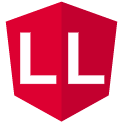

# Angular Boilerplate &middot; [](https://opensource.org/licenses/MIT) [](https://lucaslacerdacl.visualstudio.com/angular-boilerplate/_build/latest?definitionId=1) [](https://codecov.io/gh/LucasLacerdaCL/angular-boilerplate)
> This is a boilerplate in Angular 5 to give agility in front-end development.

This repository contains http, interceptors, guards, notification and storage services.

## Installing / Getting started

First of all you should clone or download the repository and change the package.json information.

```shell
git clone https://github.com/LucasLacerdaCL/angular-boilerplate.git
```

Clone the repository or download from [here](https://github.com/LucasLacerdaCL/angular-boilerplate/archive/master.zip).

## Developing

### Built With
    * Angular
    * Angular Material
    * SweetAlert2

## Versioning

* [1.0.1](https://github.com/LucasLacerdaCL/angular-boilerplate/tags)
